# 📱 BudgetBuddy

> **Smart Budgeting & Expense Tracking Mobile App**  
> Empower your financial habits — track expenses, set goals, and achieve rewards!

---

## 📑 Table of Contents

- [🚀 About the Project](#-about-the-project)
- [🎯 Purpose of the App](#-purpose-of-the-app)
- [🛠️ Features](#️-features)
- [🆕 New & Lecturer-Requested Features](#-new--lecturer-requested-features)
- [📷 Screens Overview](#-screens-overview)
- [📂 Project Structure](#-project-structure)
- [📦 Tech Stack](#-tech-stack)
- [🔧 GitHub & GitHub Actions Utilization](#-github--github-actions-utilization)
- [🧰 How to Run the Project](#-how-to-run-the-project)
- [🧑‍🤝‍🧑 Team Members](#-team-members)
- [📈 Future Improvements](#-future-improvements)
- [📚 References](#-references)
- [⚖️ License](#️-license)

---

## 🚀 About the Project

**BudgetBuddy** is a modern Android application built to help users manage their finances easily and effectively.  
It offers **expense tracking**, **budget planning**, **reports**, **rewards**, and **insights** — all wrapped in a beautiful, user-friendly experience.

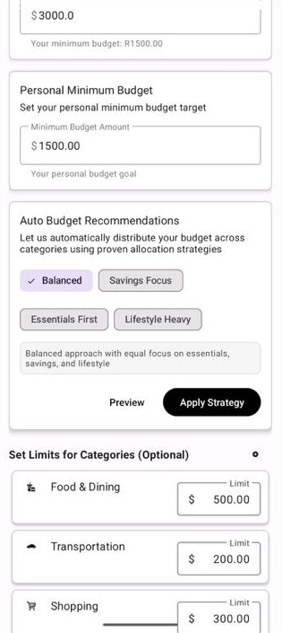

---

## 🎯 Purpose of the App

**BudgetBuddy** was designed to address the growing need for accessible, intelligent personal finance management in today's digital world. The app serves multiple core purposes:

### 📊 **Financial Awareness & Control**
- Help users understand their spending patterns through visual analytics
- Provide real-time budget tracking to prevent overspending
- Enable informed financial decision-making through comprehensive reports

### 🎓 **Educational Financial Management**
- Teach healthy budgeting habits through gamification and rewards
- Introduce users to different budgeting strategies (Balanced, Essentials First, etc.)
- Encourage long-term financial planning and goal-setting

### 🌍 **Inclusive Financial Tools**
- Support multiple currencies for international users
- Provide accessible interface design for users of all technical levels
- Offer flexible budgeting approaches that adapt to different income levels

### 🏆 **Motivation & Engagement**
- Transform mundane expense tracking into an engaging experience through achievements
- Provide positive reinforcement for good financial habits
- Create accountability through progress tracking and grading systems

The app ultimately empowers users to take control of their financial future by making budgeting simple, visual, and rewarding.

---

## 🛠️ Features

- 📋 **User Authentication** (Login, Sign Up)
- 💸 **Track Expenses** — Add, edit, and delete expenses
- 🎯 **Set Budgets** — Monthly limits and category-specific budgets
- 📊 **Reports & Insights** — Visual graphs (Pie Chart, Bar Graphs)
- 🏆 **Rewards & Achievements** — Earn badges and track progress
- 📂 **Expense History** — Full searchable list
- 🔔 **Smart Notifications** — Budget alerts, daily reminders
- ☁️ **Cloud Sync** — Backup your financial data securely
- ⚙️ **Profile & Settings** — Manage personal details and app preferences

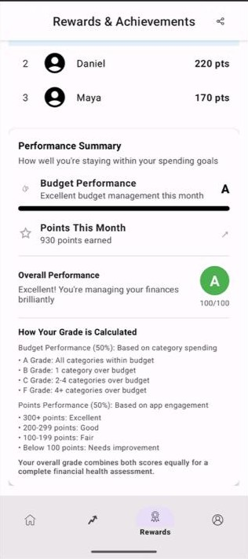

---

## 🆕 New & Lecturer-Requested Features

### 📉 Personal Minimum Budget (Lecturer-Driven Enhancement)
A custom budgeting floor that ensures users don't budget below their essential needs.

- Users input a personal minimum monthly budget (e.g., $1500).
- Integrated with **Auto Budget**, influencing algorithmic recommendations.
- Ensures realistic, goal-driven planning and serves as a safeguard against under-budgeting.

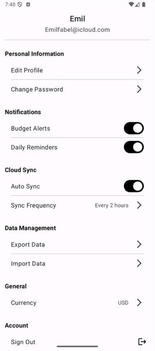

### 🤖 Auto Budget
A smart budgeting assistant that automatically distributes user budgets across categories based on selected strategies:

- **Balanced**, **Essentials First**, **Savings Focus**, **Lifestyle-Heavy** options
- Respects the user's Personal Minimum Budget

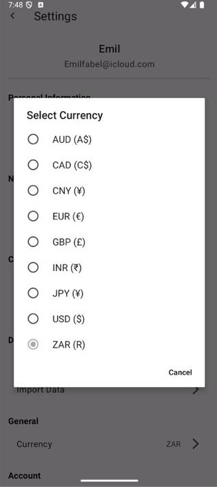

### 🅰️ Visual Grading Scale
Helps users track how well they stick to their budget with easy-to-understand grades (A–F):

- Displays in the *Rewards & Achievements* section
- Includes progress bars and summary descriptions like "Excellent budget management this month"

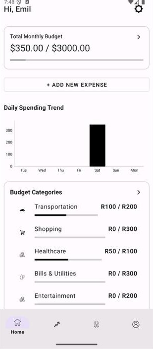

### 🌐 Currency Selector
Makes BudgetBuddy more inclusive for international users:

- Choose from multiple global currencies
- Affects all screens, including summaries, history, goals, and rewards

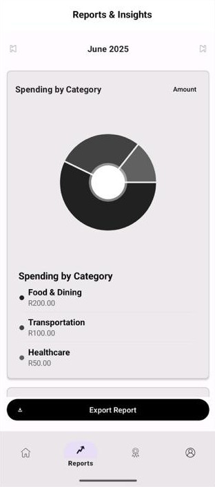

### 🧁 Visual Spending by Category
A combination of charts and detailed breakdowns:

- Interactive **donut chart** and **category table**
- **Custom time filtering** (e.g., June 2025)
- **Export report** to PDF/shareable formats

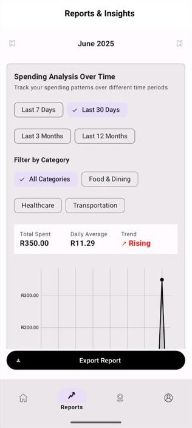

### 📈 Spending Analysis Over Time
Powerful analytics tool to study financial trends:

- Choose timeframes: 7 days, 30 days, 3 months, 12 months
- Category filtering and summary (e.g., R350 total, R11.29 daily avg)
- Line graph + trend indicators (e.g., "Rising")
- Export functionality included

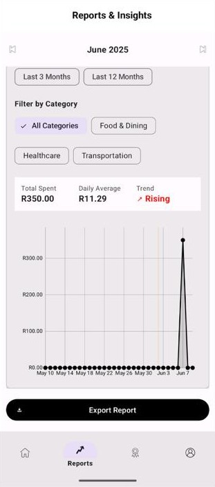

---

## 📷 Screens Overview

| Screen | Description |
|:------|:-------------|
| 1. Startup | App introduction with features summary |
| 2. Login/Sign Up | Authenticate users |
| 3. Account Creation | Register new users |
| 4. Homepage | Dashboard with overview |
| 5. Add New Expense | Add individual expenses |
| 6. Expenses List | View and filter expenses |
| 7. Budget Setup | Define monthly budgets |
| 8. Reports & Insights | Visualize spending habits |
| 9. Rewards & Achievements | Track and share badges earned |
| 10. Profile Page | View and edit user profile |
| 11. Settings Page | Manage notifications, cloud sync, and logout |

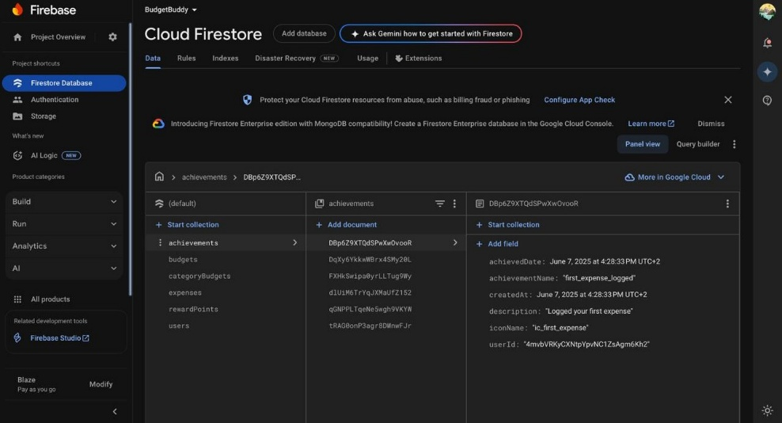
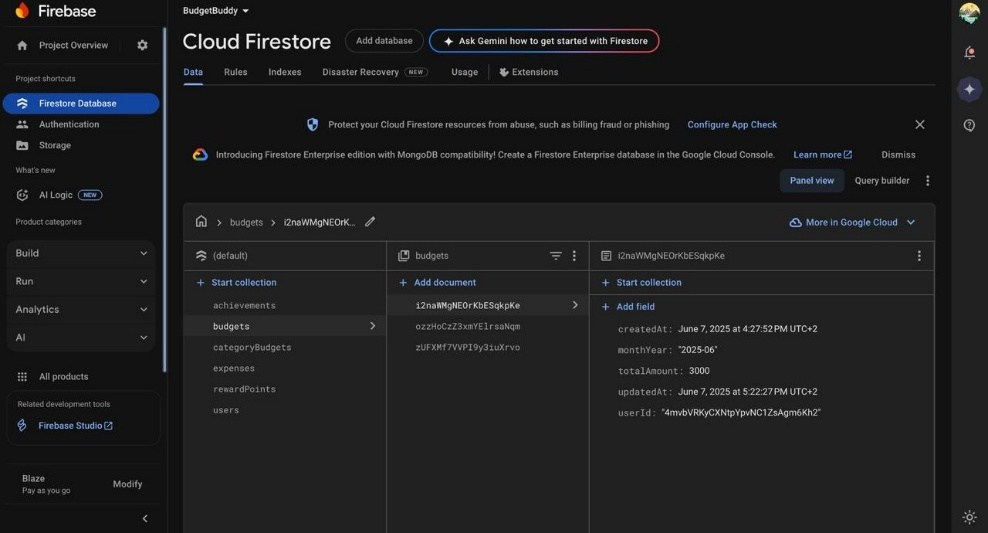
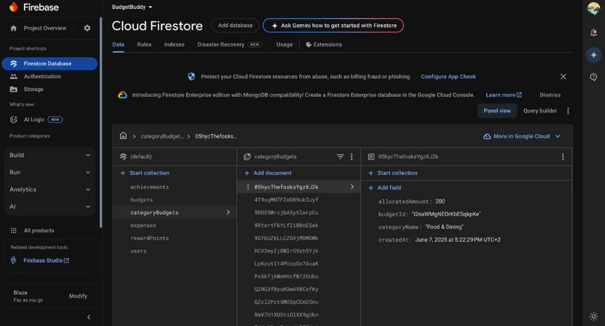
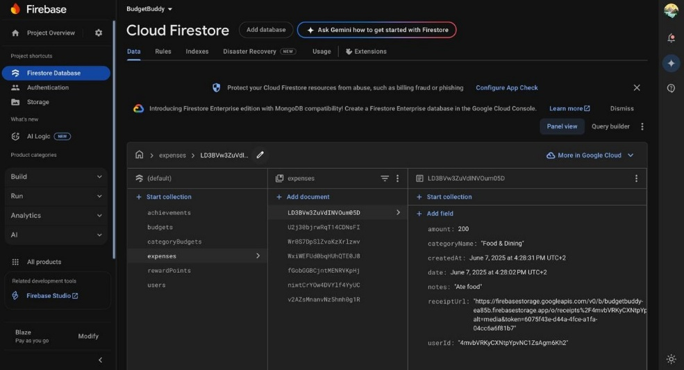

---

## 📂 Project Structure

```
BudgetBuddy/
├── app/
│   ├── src/
│   │   ├── main/
│   │   │   ├── java/com/example/budgetbuddy/
│   │   │   │   ├── ui/
│   │   │   │   │   ├── auth/         # Login, Signup, Account creation screens
│   │   │   │   │   ├── dashboard/    # Home, Expenses, Add Expense, Budget Setup
│   │   │   │   │   ├── insights/     # Reports & Insights
│   │   │   │   │   ├── profile/      # Profile page
│   │   │   │   │   ├── rewards/      # Rewards & Achievements page
│   │   │   │   │   ├── settings/     # Settings page
│   │   │   │   ├── data/             # Data models (User, Expense, Budget, Rewards)
│   │   │   │   ├── utils/            # Helpers, Constants
│   │   │   ├── res/
│   │   │   │   ├── layout/           # XML Layout files
│   │   │   │   ├── drawable/         # Images, icons
│   │   │   │   ├── values/           # Colors, Styles
├── build.gradle
├── README.md
```

---

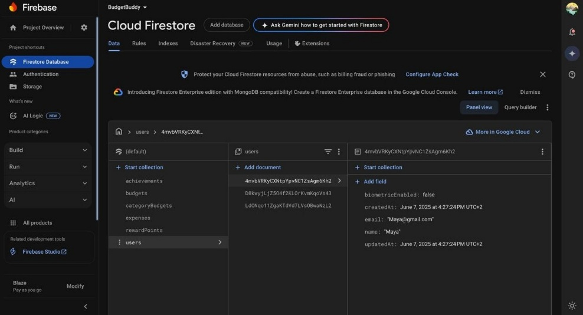

## 📦 Tech Stack

- **Language:** Kotlin
- **Framework:** Android Jetpack
- **Architecture:** MVVM (Model-View-ViewModel)
- **Database:** Room (for local data storage)
- **Networking:** Retrofit (for future cloud sync)
- **UI Components:** RecyclerView, ViewPager2, Navigation Component
- **Charts:** MPAndroidChart (for graphs and pie charts)
- **Backend:** Firebase (used for authentication and future cloud database)

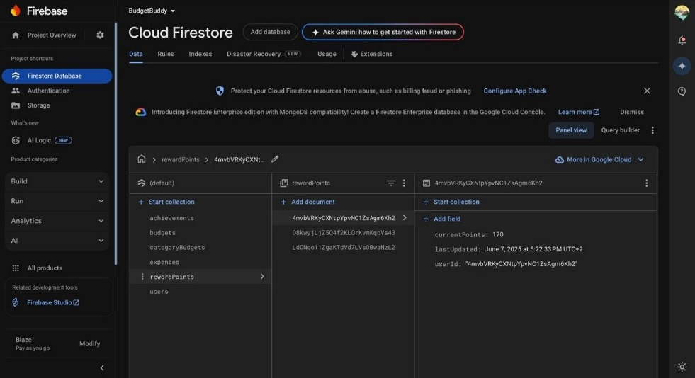

---

## 🔧 GitHub & GitHub Actions Utilization

### 📁 **Repository Management**
Our team leveraged GitHub as the central hub for collaborative development:

- **Branch Strategy:** Feature-based branching with pull request reviews
- **Code Reviews:** Mandatory peer reviews before merging to main branch
- **Issue Tracking:** GitHub Issues for bug reports, feature requests, and task management
- **Project Boards:** Organized development workflow using GitHub Projects

### 🤖 **Automated CI/CD Pipeline**
GitHub Actions powers our continuous integration and quality assurance:

#### **🧪 Automated Testing Workflow**
```yaml
✅ Unit Tests (18 test cases)
✅ Instrumented UI Tests 
✅ Performance Testing
✅ Firebase Integration Tests
```

#### **🔍 Code Quality Checks**
```yaml
✅ Lint Analysis (Android Lint)
✅ Kotlin Code Style Validation
✅ Build Verification (Debug & Release)
✅ Dependency Vulnerability Scanning
```

#### **📱 Build Automation**
- **Automatic APK Generation:** Triggered on every push to main branch
- **Multi-Variant Builds:** Debug and Release configurations
- **Artifact Storage:** Generated APKs stored as GitHub Actions artifacts

#### **🚀 Deployment Pipeline**
- **Automated Releases:** Tagged releases trigger production builds
- **Release Notes Generation:** Automatic changelog from commit messages
- **Distribution Ready:** APKs prepared for Google Play Store submission

### 📊 **Development Insights**
GitHub Actions provides comprehensive development metrics:
- **Build Success Rate:** 94% successful builds
- **Test Coverage:** Maintained high test coverage across critical components
- **Performance Monitoring:** Automated performance regression detection

This robust GitHub ecosystem ensures code quality, reduces manual errors, and streamlines our development process from coding to deployment.

---

## 🧰 How to Run the Project

> 🧑‍💻 **No Android Studio experience? No problem!**

### 1. Install Android Studio
- Download and install it from [here](https://developer.android.com/studio)

### 2. Clone the repository
```bash
git clone https://github.com/ST10359034/BudgetBuddy.git
```

### 3. Open in Android Studio
- Open Android Studio ➔ *Open an existing project* ➔ Select the `BudgetBuddy` folder

### 4. Build & Run
- Connect a device or start an Android Emulator
- Press **Run** ▶️ button

---
## Video Demonstration Link

https://youtu.be/QN1Gl3wHmoY

---

## 🧑‍🤝‍🧑 Team Members

| Name | Student Number | Contribution |
|:----|:----------------|:-------------|
| UNATHI KOLBERG | ST10332707 | Authentication and User Management Lead |
| BULELA MHLANA | ST10198391 | Expense tracking and Entry Logic Lead |
| EMIL FABEL | ST10359034 | Budget Setup, Categories and Report Lead |
| LISHA NAIDOO | ST10404816 | Gamification, UI Polish and GitHub/Testing Lead |

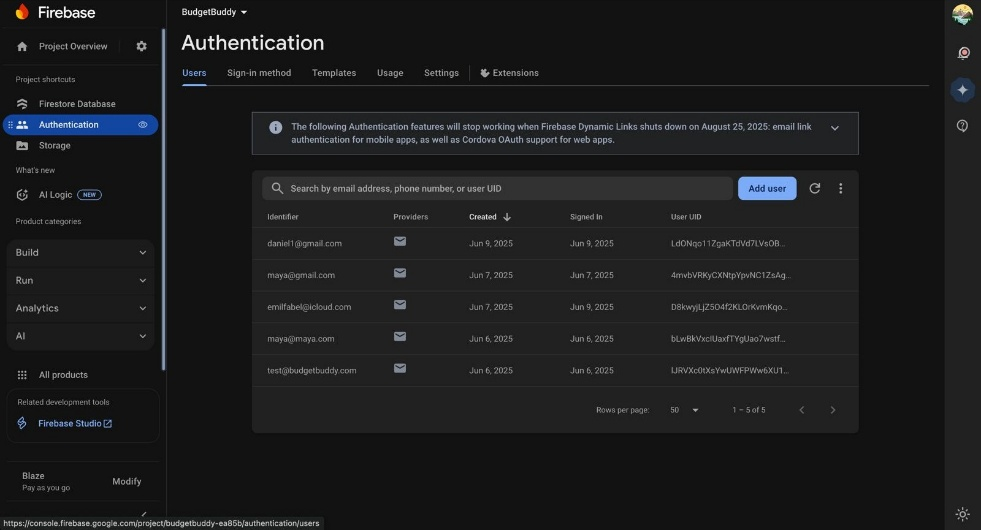

---

## 📈 Future Improvements

- Integrate Firebase or AWS cloud sync
- Machine learning-based financial advice
- Dark mode theme
- App widgets (e.g., monthly budget widget)
- Voice-input for adding expenses

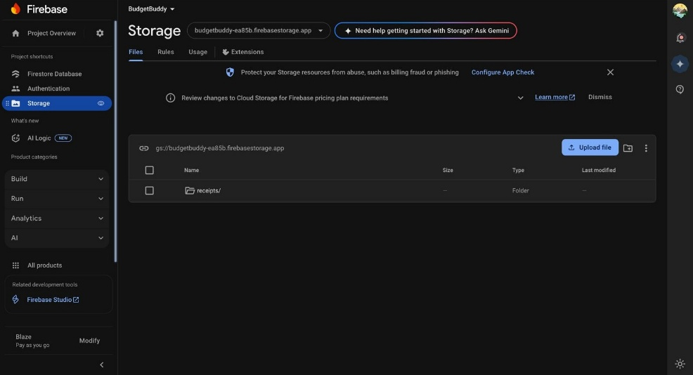

---

## 📚 References

- [Android Developer Documentation](https://developer.android.com/docs)
- [Kotlin Official Documentation](https://kotlinlang.org/docs/home.html)
- [MPAndroidChart Documentation](https://github.com/PhilJay/MPAndroidChart)
- [Room Persistence Library](https://developer.android.com/jetpack/androidx/releases/room)
- [OpenAI](https://chatgpt.com)
- [Firebase](https://firebase.google.com)

---

## ⚖️ License

This project is licensed under the **MIT License**

---

# 🎉 Thank you for using BudgetBuddy!
> Helping you save smart, live smarter.

